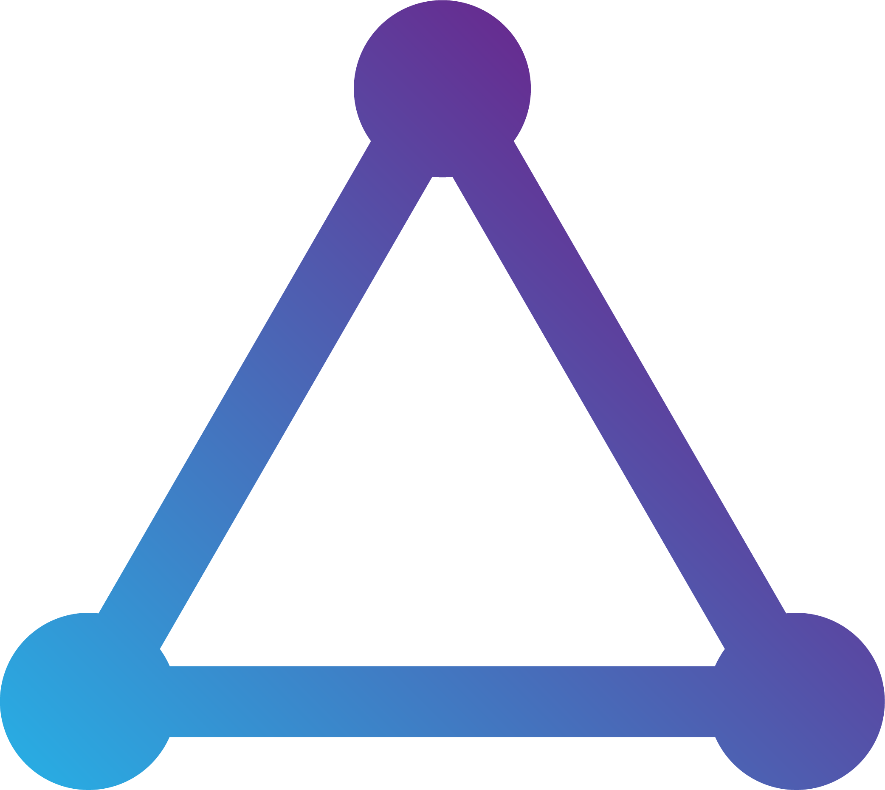

  

<h1 align="center"><b>Prototope</b></h1>

**Prototope** is an [Isotope](https://github.com/Isotope-js/core)-based JavaScript library for speedy UI prototyping.

Why Isotope?

- **Isotope-based** - Prototope is based on Isotope - fast & lightweight UI library - to utilize its simple API and SSR capabilities.
- **Simple** - Prototope's API is truly simple, allowing you to learn it and build your app in a matter of minutes!
- **TypeScript-ready** - Prototope is written in TypeScript, enabling autocompletion and other useful features in modern editors.

Interested? Get started by checking out the [docs](https://areknawo.com/prototope).

> Prototope is inspired by Tailwind, if you're looking for a CSS equivalent of Prototope, check out [Tailwind](https://github.com/tailwindcss/tailwindcss)